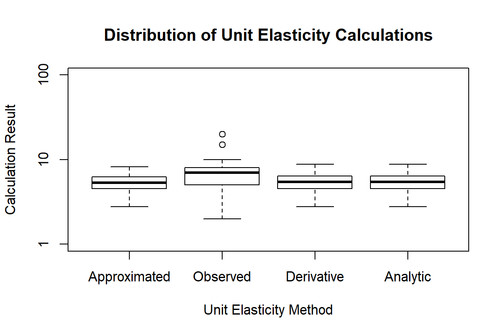

### Abstract

Research applying the behavioral economic demand framework is increasingly conducted across disciplines, as is research on improving the mathematical accuracy of demand metrics. At present, a variety of methods have been introduced to solve for the point of unit elasticity, or PMAX, in the Exponential model of demand; however, most of these methods vary in their potential for error due to being empirical approximations. Various methods for determining PMAX are presented here and a novel exact solution for PMAX in the Exponential model of demand is introduced. This solution provides an exact calculation of PMAX using the omega function, as algebraic solutions are not possible. This novel approach is introduced, discussed, and systematically compared to earlier methods for determining PMAX using computer simulations. Systematic comparison indicated that this new approach, an exact analytic solution for PMAX, provides results that are identical to computationally-intensive PMAX methods that directly evaluate the slope of the demand function. The exact analytic PMAX approach is reviewed, its calculations explained, and an easy-to-use web tool is provided to assist researchers in easily performing this calculation of PMAX. Implications for reducing potential sources of error are reviewed and future directions are also discussed.

[Working Sample](http://www.smallnstats.com/index.php?page=PMAX)

### Introduction

Classical economic theory employs demand analyses to understand market influence on consumers’ willingness to pay for particular goods and services. Central to demand theory is the notion of demand elasticity, which is defined as the “ratio of the relative change in a dependent to the relative change in an independent variable” (Watson & Holman, 1977; p. 34). Behavioral economists have translated this concept to the consideration of reinforcement operations on operant responding. Operant behavioral economics, namely the methods specific to studying operant demand, provide a framework for quantifying response-reinforcer relationships under some type of constraint (number of responses required per unit of reinforcer, delay to reinforcement, effort associated with responding for one unit of reinforcement, etc.; e.g., Hursh, 1980, 1984; Kagel & Winkler, 1972; Rachlin, Green, Kagel, & Battalio, 1976) . Demand elasticity in operant psychology may thereby be used to provide a quantification of a reinforcer’s hedonic or motivational value.

The relationship between the consumption of a reinforcer and the requirements necessary to produce them is complex, though it has been effectively modeled in several ways (Hursh, Raslear, Bauman, & Black, 1989; Hursh & Silberberg, 2008; Koffarnus, Franck, Stein, & Bickel, 2015). Regardless of the specific model used to quantify the demand for reinforcers, the operant demand approach (hereafter considered synonymous with the simple term, “demand”) has been particularly useful in the context of various willingness-to-pay tasks – particularly, purchase tasks (Roma, Reed, DiGennaro Reed, & Hursh, 2017). In purchase tasks, the demand for substances or goods such as alcohol (Gentile, Librizzi, & Martinetti, 2012; Murphy & MacKillop, 2006), nicotine (MacKillop et al., 2008; MacKillop & Tidey, 2011), or marijuana (Aston, Metrik, & MacKillop, 2015; Collins, Vincent, Yu, Liu, & Epstein, 2014) is assessed at various financial costs. In these real or hypothetical situations, the monetary price to consume a reinforcer is systematically varied, and inferences are drawn based on the degree to which participants will defend their baseline levels of consumption as prices increase (Hursh, 1980, 1984).

Beyond characterizing abuse liability for drugs and other addictive substances, the operant demand framework has also been applied to other areas of choice and decision-making, such as food intake and dietary choices (Epstein et al., 2018; Epstein & Saelens, 2000; Epstein, Smith, Vara, & Rodefer, 1991; Saelens & Epstein, 1996), use of indoor tanning services (Reed, Kaplan, Becirevic, Roma, & Hursh, 2016), and general purchasing behavior (Foxall, Olivera-Castro, Schrezenmaier, & James, 2007; Foxall, Wells, Chang, & Oliveira-Castro, 2010). Additionally, more recent work has also extended this methodology to topics such as organizational behavior management e.g., workforce attrition and incentives (Henley, DiGennaro Reed, Kaplan, & Reed, 2016; Henley, DiGennaro Reed, Reed, & Kaplan, 2016), “green” consumerism (Kaplan, Gelino, & Reed, 2018), and informing interventions for individuals with developmental and/or intellectual disabilities (Gilroy, Kaplan, & Leader, 2018; Reed, Kaplan, & Becirevic, 2015; Reed et al., 2009). On a macro level, this framework has also extended to the population level, providing opportunities to develop empirically-supported public policy (Guthrie, 2017; Hursh, 1991; Hursh & Roma, 2013; MacKillop et al., 2012; Reed et al., 2016). 

### Demand Curve Analyses

Current methods for quantifying the strength, or potency, of a reinforcer represent this quality as a curve, whereby the overall consumption of a reinforcer (𝑄) slopes downward as a nonlinear function of increasing cost (𝑃) (Hursh, 1980, 1984). Prior to representing reinforcer efficacy in this way, earlier methods compared the potency of reinforcers based on traditional measures of relative reinforcer efficacy (Johnson & Bickel, 2006). For example, the potency of a reinforcer might be compared to another based on some aspect of responding under constraint, which might include peak levels of responding (i.e., highest rates of responding), reinforcer breakpoint (i.e., the leanest effective schedule of reinforcement), or some other aspect of responding, such as preference (Katz, 1990). These earlier methods, which compare reinforcers based on one aspect of the response-reinforcer relationship, have since been superseded by demand curves, which represent reinforcer efficacy as a multidimensional construct with metrics arising from the curve (Bickel & Madden, 1999; Bickel, Marsch, & Carroll, 2000; Johnson & Bickel, 2006).

Representing reinforcer efficacy as a curve offers several advantages over earlier approaches (Johnson & Bickel, 2006; Reed, Niileksela, & Kaplan, 2013). For example, this approach serves to integrate various aspects of the response-reinforcer relationship in a single, unified approach. Further, modeling the demand in this way reveals additional qualities of reinforcers. Among these, the demand curve permits an analysis of the elasticity of demand for a reinforcer (Hursh, 2014; Hursh & Silberberg, 2008; Lea, 1978; Lea & Roper, 1977). Briefly, the demand for reinforcers is differentially influenced by constraints such as price and time. Changes in consumption as a function of changes in the cost-benefit ratio are referred to as the elasticity of demand and indexes the degree to which consumption is sensitive to these increasing costs. That is, there are regions of the demand curve where consumption is relatively unaffected by increases in costs and others where consumption is substantially affected by increases in cost (see the left panel of Figure 1). These regions are termed the inelastic and elastic ranges of the demand curve, respectively, and prices associated with each range exert differential effects on consumption. Demarcating these two regions of the demand curve is the point of unit elasticity or PMAX, a location upon the demand curve whereby one log-unit increase in price is accompanied by one log-unit decrease in levels of predicted consumption (i.e., −1 unit consumption / 1 unit price = −1 unit change). This ratio (i.e., slope) is near zero at low prices and grows increasingly negative as larger changes in consumption take place. An example of this slope and the calculations involved are illustrated in the right panel of Figure 1. In this example, unit prices less than PMAX are associated with smaller changes in levels of consumption when prices increase (i.e., −1< 𝑓′(𝑥)< 0) and costs greater than PMAX are associated with larger changes in consumption when prices increase (i.e., 𝑓′(𝑥)<−1)1. 

### Approximations of Unit Elasticity

Concerning the most often used models of operant demand, the Exponential (Hursh & Silberberg, 2008) and Exponentiated (Koffarnus et al., 2015) models, methods for determining PMAX have varied in several ways. Before discussing these ways, we make note that calculations of the model slope are ultimately the same for both the Exponential and Exponentiated models. This is because elasticity is assessed in Log-Log space and scaling the Exponentiated model of demand into Log space ultimately results in the same demand projected by the Exponential model. As such, we will be referencing the Exponential model primarily throughout this work, and the structure of this model takes the following form:

                                              log10Q= log10Q0+k(e−alpha∗Q0∗x−1) 

As first noted by the model authors (Hursh & Roma, 2013; Hursh & Silberberg, 2008), an arithmetic solution for PMAX is not available. The terms of this model’s first order derivative prohibit an arithmetical solution for the price (i.e., 𝑥) at a slope of −1 because the term for price (i.e., 𝑥) appears twice in the derivative—both inside and outside of the exponent. As a workaround to this issue, alternative approaches for calculating (or approximating) PMAX have been introduced. First, PMAX can be approximated empirically by “observing” a point of maximum responding (i.e., OMAX). In this approach, the empirical OMAX represents the highest total responding across the prices directly evaluated. The empirical OMAX can be used to approximate an “observed” PMAX for the empirical demand curve, since the two metrics are related (Greenwald & Hursh, 2006). This approach is driven by the available data alone and is not specific to any model of demand. This Observed PMAX uses the data alone to determine the price associated with the highest levels of responding before decreasing. Second, there are mathematical formulas that provide an approximation of PMAX using the fitted model parameters (Hursh, 2014; Hursh & Roma, 2013). The Approximate PMAX formulas produce values that are highly correlated with the true PMAX that would be found if directly evaluating the slope of the demand curve. Lastly, a true PMAX can be determined using specialized software wherein a program systematically searches for the price where the first order derivative is equal to −1 (Hursh & Roma, 2013)2. In this approach, referred to here as Derivative PMAX, an algorithm is used to iteratively search for PMAX using a fitted demand function. While several methods are available for determining PMAX, there are inevitable variations in the values resulting from each of these methods and this variability is inherently due to the difficulties solving for an exact slope of −1. Any variations in PMAX values presents challenges for comparing values across studies and for the accuracy of making population-level (e.g., public policy, organizational policies) recommendations.

### An Exact Solution for Unit Elasticity

While there is no arithmetic solution for PMAX, there are alternatives where a slope of −1 can be determined without the need for specialized computer programs. For example, the Lambert W (i.e., omega) function can be used with the first order derivative of the Exponential model of demand to solve for PMAX. Briefly, Lambert W allows for the solving of 𝑥 when a function takes the form of 𝑦=𝑥𝑒𝑥. This is desirable in the case of the first order derivative of the Exponential model of demand because this applies to the 𝑥 terms that exist inside and outside of the exponent. Using the W function, this simple example then takes the form of 𝑥=𝑊(𝑦). As such, the same logic may be applied to the first order derivative for PMAX. 

The purpose of this study was to evaluate the accuracy and reliability of an Exact solution for PMAX in the Exponential model of demand—hereafter referred to as Analytic PMAX. To evaluate this novel approach, computer simulations were constructed to generate a range of hypothetical demand curves and facilitate a comparison of the various methods for calculating PMAX. Specifically, this study asked the following questions: 1) To what degree do the Observed, Approximate, Derivative, and Analytic methods of calculating PMAX correspond with one another and 2) does the Analytic method of calculating PMAX provide results consistent with the Derivative, or exact, PMAX from which it was derived.

###                                                         Method

### Simulated Data Series

A total of 1,000 simulated consumption series were generated from the results of an earlier peer-reviewed study on decision-making (Kaplan & Reed, 2018) and all simulations were conducted using the R statistical program (R Core Team, 2017). Participants in Kaplan and Reed (2018) were recruited using the Amazon Mechanical Turk (www.mturk.com) platform to complete a hypothetical Alcohol Purchase Task (APT; Kaplan, Foster, et al., 2018). Although the purpose of the source study was to investigate the influence of “happy hour” specials on self-reported alcohol purchases, only data from the standard APT were used as a basis for computer simulation. The following prices were included in the APT: $0.00 (free), $0.25, $0.50, $1.00, $1.50, $2.00, $2.50, $3.00, $4.00, $5.00, $6.00, $7.00, $8.00, $9.00, $10.00, $15.00, and $20.00. Simulated consumption at each price point was constructed using means and standard deviations in overall responding at that respective price point. Simulated consumption series that met criteria for systematic responding (Stein, Koffarnus, Snider, Quisenberry, & Bickel, 2015) and R2 values greater than 0.8 were included in the simulations used to compare unit elasticity methods. A complete description of the computer simulation, as well as the source code necessary to reproduce the data and analyses, is provided in the Appendix. 

### Nonlinear Model Fitting

Demand curve analyses were performed using beezdemand R package (Kaplan, Gilroy, Reed, Koffarnus, & Hursh, Under Review), a peer-reviewed package that features various modeling methods specific to operant demand. Individual Q0 and alpha values were fitted using FitCurves at default settings for the Exponential model of demand. Optimization in beezdemand was performed using the Gauss-Newton optimizer included in the default nonlinear curve-fitting method (nls) in the R program (R Core Team, 2017). Scaling constant k was determined separately for each simulated series by subtracting the minimum level of consumption from the maximum level of consumption, each in log10 units, and adding a value of 0.5. A value of 0.5 was added to this range to minimize risks associated with using a k value that does not reflect the full range of observed consumption values (Gentile et al., 2012; Kaplan, Foster, et al., 2018). 

### Calculations of Unit Elasticity

A total of four methods for determining PMAX were evaluated using simulated participant responding. Each method was evaluated using the Exponential Model of demand, and all calculations were performed using the R statistical program (R Core Team, 2017). All materials used to simulate and perform these analyses have been open sourced, and details for acquiring them are provided in the Appendix of this work. Each method included in this evaluation is listed and explained below.

###   Observed PMAX

As an alternative to evaluating the slope of a fitted model, or numerically approximating it, an “observed” PMAX can be inferred from the highest levels of observed responding, the empirical OMAX (Greenwald & Hursh, 2006). As PMAX is related to OMAX, the empirical OMAX (i.e., based solely on observed data) can be assumed to represent the ordinate of unit elasticity while PMAX would be represented by the abscissa (i.e., price). In this way, the Observed PMAX infers model slope without model fitting by using the location of the empirical OMAX on the x-axis (i.e., price). Numerically, the total levels of responding are calculated at each price point multiplying levels of consumption by the corresponding unit price. This provides a series of values that reflect the maximum levels of responding at each price point. From these values, the unit price associated with the highest levels of responding is considered to represent the Observed PMAX.

### Approximate PMAX

First introduced along with the Exponential model demand (Hursh & Silberberg, 2008), and later revised (Hursh, 2014), the unit price where a demand curve reaches unit elasticity can be approximated numerically using fitted model parameters. This calculation is not derived from the slope, per se, though it results in a value that closely approximates the true PMAX. The latest form of Approximate PMAX is calculated as listed below:

                                                      EQUATION HERE

Limitations of this approach have been noted by model authors, namely that error varies significantly with respect to the size of scaling parameter k. However, despite some limitations, this calculation has been found to be a good approximation for many combinations of fitted demand parameters (Hursh, 2014; Hursh & Roma, 2013). 

### Derivative PMAX

In contrast to numerical approximates, the slope of the Exponential demand curve can be iteratively evaluated using its first order derivative and specialized computer programming. The results of the approach have been previously referred to as a true or Exact PMAX (Hursh & Roma, 2013), as results are determined using a computationally-exhaustive process that directly evaluates model slope at various unit prices until the first order derivative equals −1. The first order derivative, as provided by Hursh and Silberberg (2008), takes the following form:

                                                       EQUATION HERE

While not required, this method can be adapted into a more easily optimized loss function by adding a constant of 1 and taking the absolute value of the result. A visual comparison of these two objective functions is provided in Figure 2. In effect, this modification represents PMAX as a zero value when the slope of the demand function is −1 (i.e., −1+1=0). Further, taking the absolute value produces a ‘V’-shaped function wherein the lowest point in this function represents PMAX. This form improves the speed and simplicity of an optimization routine, which iteratively searches for the price wherein the loss function is at its minimum. This loss function was used along with the default minimization method in R, optim, using a port of the Broyden–Fletcher–Goldfarb–Shanno algorithm (Nash, 1990).

### Analytic PMAX

As an alternative to empirical, approximate, and iterative computer methods, PMAX can be calculated analytically using the W function. Simply put, the terms of the first order derivative provided by (Hursh & Roma, 2013) can be rearranged (where alpha, Q0, and constant k are known) so that unit price can be solved at a slope value of −1. This solution is possible algebraically given that the 𝑥 term appears inside and outside of the exponent, as previously noted by the model authors (Hursh & Silberberg, 2008). However, this challenge can be addressed using the W function and one can construct the form required to use the W function (i.e., 𝑦=𝑥𝑒𝑥) by rearranging several terms, as follows: 

                                                       EQUATION HERE
                                                       
In the equations shown above, the necessary form to use with the W function can be prepared so that a solution for a slope of −1 is possible. The final solution for PMAX using the W function is as follows:

                                                       EQUATION HERE

While well-suited to this application, it warrants noting that the Lambert function is complex and multiple branches and solutions can exist (i.e., real and imaginary). However, for our purposes, we will use the primary branch of this function, as denoted by W0. This branch has both real and imaginary solutions and this method of solving for PMAX is possible so long as the value used in W0 exists within the following range:

                                                        EQUATION HERE

Put simply, this approach results in an exact calculation of PMAX provided that the k used to fit the model exists above a certain lower limit. In this approach, especially small ks would push the value supplied to W0 outside of the range specified above and into a region where no real solutions exist. Solving for this absolute lower limit, an Analytic PMAX can be calculated in all cases where constant k that exists above a lower limit of 1.180535 and the exact determination of this value is provided below:

                                                         EQUATION HERE

Given that this novel approach is an exact solution for the Derivative approach, the Analytic method should provide results that identical to the Derivative method without the need for specialized computer programming. In contrast, Analytic PMAX may be performed using scientific calculators or customized spreadsheet software. The specific methods used to perform the W function in this study were derived from the GNU Scientific Library, an open-source library of mathematical methods (Gough, 2009), and the specific methods for performing these calculations can be found by referring to the Appendix.

### Data Analysis Plan

The methods described above were systematically compared to evaluate the accuracy, reliability, and correspondence between calculations of unit elasticity. Each of the individual unit elasticity calculations described above was performed for each of the 1,000 simulated series and correspondence was assessed using Pearson correlations and scatterplots. Scatterplot comparisons were constructed to illustrate the correspondence between measures and correlations were calculated overall as well as with select, well-fitting models (R2 > .9).

### Results

The distribution of results from each method for calculating PMAX calculation is illustrated in Figure 3 and described in Table 1. The results of simulated comparisons revealed that all approaches for determining PMAX were correlated with one another though to varying degrees. The distribution of results for each method is described in Table 2 and displayed as scatter plots in Figure 4. Across degrees of model fit, the Observed PMAX approach consistently provided more widely distributed values than the other approaches, and these ranges are described in Table 1. This approach reliably produced results that ranged much lower and much higher than other methods, see Figure 3. 

Consistent with the shared mathematical basis for the Derivative and Analytic approaches, the results from both approaches were perfectly correlated (r = 1). Similarly, the Approximate method provided results that were highly correlated with both the Derivative and Analytic methods (rs = 0.993). In contrast, the Observed approach provided results that were not as strongly correlated overall with the Approximate (r = 0.291), Derivative (r = 0.283), or Analytic PMAX (r = 0.283). The results provided by the Observed method were more highly correlated with the Approximate (r = 0.428), Derivative (r = 0.421), or Analytic PMAX (r = 0.421). These relationships are more thoroughly described in Table 2 and illustrated in Figure 4.

### Discussion

The results from applied behavioral economic studies of demand are increasingly used as evidence to support various initiatives, such as public policy (Hursh & Roma, 2013). However, the presence of varying approaches for calculating PMAX naturally introduces some degree of error when determining prices that exist in the inelastic and elastic ranges. This is an area in need of precision and reliability, as both clinical and policy decisions may be directly or indirectly informed by the elasticity of demand for some good (e.g., nicotine, alcohol) or reinforcer (e.g., behavior functions, incentives). Precision is paramount here, as even small levels of variability could result in negative effects for clinical applications (e.g., poorer treatment outcomes), organizational-level decisions (e.g., employee attrition, ineffective incentive systems), and policy-level decisions alike (e.g., ineffective policy, limited replicability, poor use of taxpayer funding). Given that there is a need to precisely and reliably determine PMAX, this report was designed to answer the following questions: 1) To what degrees do the Observed, Approximate, Derivative, and Analytic methods for calculating PMAX correspond with one another; and 2) To what degree does the Analytic method correspond with the Derivative method of calculating PMAX? Based on results from this study, all methods for calculating of PMAX appear to be correlated with one another, though to varying degrees. Further, the Derivative and Analytic methods for calculating PMAX appear to be perfectly correlated and this 1:1 match is expected given the mathematical basis from which the Analytic method was derived.

While providing identical results, the Analytic PMAX method offers several advantages over the computationally-intensive Derivative method. First, the Analytic method is computationally much simpler and can be performed by researchers without programming skills. For example, this method can be accommodated in customized spreadsheet software or even on simple websites. As an example of the simplicity, the Analytic method has been adapted for use in a web-based calculator hosted by the first author and a link to this tool is provided in the Appendix. In this way, researchers without programming skills can easily access a method for calculating an exact form of PMAX. Second, improving the accessibility of this newer and exact form of PMAX (relative to Derivative method) serves to minimize, if not completely eliminate, the inherent variability introduced when relying on Approximated PMAX values. That is, researchers may calculate the Analytic PMAX just as easily as they would calculate an Approximate PMAX, requiring only the Q0, alpha, and k values. Simplicity aside, this approach effectively eliminates the error associated with relying on empirical or approximate calculations of PMAX. The variability observed in these approaches is indicated in Table 2 and both empirical and approximate methods contribute to error in varying degrees. In contrast, the Analytic approach consistently resulted in PMAX values that were identical to the Derivative, or exact, PMAX.

### Limitations

While the methods introduced here provide one means of reducing sources of error in assessing elasticity, it warrants noting that the manner of calculating PMAX is only one of several sources of variability. For example, the nature of purchase tasks and how consumption data are collected naturally influence the analyses that follow. In such tasks, factors such as the range of prices sampled, the step sizes between these prices, and characteristics of individual prices (e.g., left-digit effects) can each affect analyses of demand. Even further, these novel methods are only an improvement insofar as the Exponential model of demand effectively represents the data being modeled. 

While the results from computer simulation are encouraging and support the Analytic approach as a “drop-in” replacement for exact (i.e., Derivative) PMAX methods, additional replication with real-world data is necessary and this is necessary for several reasons. First, additional study is necessary to understand the relative benefits of this novel approach over other methods for evaluating elasticity. For example, the differences between Approximate and Derivative/Analytic approaches may be so minor that any potential error would affect neither the inferences drawn nor results from statistical comparisons between groups. As such, in certain cases the Approximate approach may introduce such low levels of error that it essentially does not impact subsequent analyses. Second, further study is necessary to determine how the limits imposed on k values in this newer method would impact real-world use. The issue of a hard lower limit may ultimately be a non-issue, as it is more often suggested to err on the side of larger k values by adding a small constant (i.e., 0.5; Kaplan, Foster, et al., 2018) and because k values less than 1 would suggestive that consumption did not change even one log10 unit (i.e., a slope of −1 was not even observed). To this effect, further research on how to most effectively construct parameter k is needed and the limits imposed by this method (i.e., W0 and −𝑒−1) may be prudent as an absolute lower limit. However, this is an empirical question to be asked along with future replication with both real and simulated usage.

### Credits

* Shawn GilroyReferences 

Aston, E. R., Metrik, J., & MacKillop, J. (2015). Further validation of a marijuana purchase task. Drug & Alcohol Dependence, 152, 32-38. doi:10.1016/j.drugalcdep.2015.04.025

Bickel, W. K., & Madden, G. J. (1999). A comparison of measures of relative reinforcing efficacy and behavioral economics: cigarettes and money in smokers. Behavioural Pharmacology, 10(6-7), 627-637. doi:10.1097/00008877-199911000-00009 

Bickel, W. K., Marsch, L. A., & Carroll, M. E. (2000). Deconstructing relative reinforcing efficacy and situating the measures of pharmacological reinforcement with behavioral economics: a theoretical proposal. Psychopharmacology, 153(1), 44-56. 

Collins, R. L., Vincent, P. C., Yu, J., Liu, L., & Epstein, L. H. (2014). A behavioral economic approach to assessing demand for marijuana. Experimental and Clinical Psychopharmacology, 22(3), 211-221. doi:10.1037/Fa0035318

Epstein, L. H., Paluch, R. A., Carr, K. A., Temple, J. L., Bickel, W. K., & MacKillop, J. (2018). Reinforcing value and hypothetical behavioral economic demand for food and their relation to BMI. Eating behaviors, 29, 120-127.

Epstein, L. H., & Saelens, B. E. (2000). Behavioral economics of obesity: Food intake and energy expenditure. In Reframing health behavior change with behavioral economics. (pp. 293-311). Mahwah, NJ, US: Lawrence Erlbaum Associates Publishers.

Epstein, L. H., Smith, J. A., Vara, L. S., & Rodefer, J. S. (1991). Behavioral economic analysis of activity choice in obese children. Health Psychol, 10(5), 311-316.

Foxall, G. R., Olivera-Castro, J., Schrezenmaier, T., & James, V. (2007). The Behavioral Economics of Brand Choice: Springer. 

Foxall, G. R., Wells, V. K., Chang, S. W., & Oliveira-Castro, J. M. (2010). Substitutability and Independence: Matching Analyses of Brands and Products. Journal of Organizational Behavior Management, 30(2), 145-160. doi:10.1080/01608061003756414

Gentile, N. D., Librizzi, E. H., & Martinetti, M. P. (2012). Academic constraints on alcohol consumption in college students: a behavioral economic analysis. Experimental and Clinical Psychopharmacology, 20(5), 390-399. doi:10.1037/a0029665

Gilroy, S. P., Kaplan, B. A., & Leader, G. (2018). A Systematic Review of Applied Behavioral Economics in Assessments and Treatments for Individuals with Developmental Disabilities. Review Journal of Autism and Developmental Disorders. doi:10.1007/s40489-018-0136-6 

Gough, B. (2009). GNU scientific library reference manual: Network Theory Ltd.

Greenwald, M. K., & Hursh, S. R. (2006). Behavioral economic analysis of opioid consumption in heroin-dependent individuals: effects of unit price and pre-session drug supply. Drug & Alcohol Dependence, 85(1), 35-48. doi:10.1016/j.drugalcdep.2006.03.007

Guthrie, J. F. (2017). Integrating Behavioral Economics into Nutrition Education Research and Practice. Journal of Nutrition Education and Behavior, 49(8), 700-705 e701. doi:10.1016/j.jneb.2016.09.006

Henley, A. J., DiGennaro Reed, F. D., Kaplan, B. A., & Reed, D. D. (2016). Quantifying efficacy of workplace reinforcers: An application of behavioral economic demand to evaluate hypothetical work performance. Translational Issues in Psychological Science, 2(2), 174. 

Henley, A. J., DiGennaro Reed, F. D., Reed, D. D., & Kaplan, B. A. (2016). A crowdsourced nickel-and-dime approach to analog OBM research: A behavioral economic framework for understanding workforce attrition. Journal of the Experimental Analysis of Behavior, 106(2), 134-144. doi:10.1002/jeab.220

Hursh, S. R. (1980). Economic concepts for the analysis of behavior. Journal of the Experimental Analysis of Behavior, 34(2), 219-238. doi:10.1901/jeab.1980.34-219 

Hursh, S. R. (1984). Behavioral economics. Journal of the Experimental Analysis of Behavior, 42(3), 435-452. doi:10.1901/jeab.1984.42-435

Hursh, S. R. (1991). Behavioral economics of drug self-administration and drug abuse policy. Journal of the Experimental Analysis of Behavior, 56(2), 377-393. doi:10.1901/jeab.1991.56-377 

Hursh, S. R. (2014). Behavioral Economics and the Analysis of Consumption and Choice. In The Wiley Blackwell Handbook of Operant and Classical Conditioning (pp. 275-305): Wiley-Blackwell.

Hursh, S. R., Raslear, T. G., Bauman, R., & Black, H. (1989). The Quantitative Analysis of Economic Behavior With Laboratory Animals. In K. G. Grunert & F. Ölander (Eds.), Understanding Economic Behaviour (pp. 393–407). Dordrecht: Springer Netherlands.

Hursh, S. R., & Roma, P. G. (2013). Behavioral economics and empirical public policy. Journal of the Experimental Analysis of Behavior, 99(1), 98-124. doi:10.1002/jeab.7 

Hursh, S. R., & Silberberg, A. (2008). Economic demand and essential value. Psychological Review, 115(1), 186-198. doi:10.1037/0033-295X.115.1.186

Johnson, M. W., & Bickel, W. K. (2006). Replacing relative reinforcing efficacy with behavioral economic demand curves. Journal of the Experimental Analysis of Behavior, 85(1), 73-93. doi:10.1901/jeab.2006.102-04 

Kagel, J. H., & Winkler, R. C. (1972). Behavioral economics: areas of cooperative research between economics and applied behavioral analysis1. Journal of Applied Behavior Analysis, 5(3), 335-342. doi:10.1901/jaba.1972.5-335 

Kaplan, B. A., Foster, R. N. S., Reed, D. D., Amlung, M., Murphy, J. G., & MacKillop, J. (2018). Understanding alcohol motivation using the Alcohol Purchase Task: A methodological systematic review. Drug and Alcohol Dependence. doi:10.1016/j.drugalcdep.2018.06.029 

Kaplan, B. A., Gelino, B. W., & Reed, D. D. (2018). A Behavioral Economic Approach to Green Consumerism: Demand for Reusable Shopping Bags. Behavior and Social Issues, 27, 20-30.

Kaplan, B. A., Gilroy, S. P., Reed, D. D., Koffarnus, M. N., & Hursh, S. R. (Under Review). The R package beezdemand: Behavioral Economic Easy Demand. Perspectives on Behavior Science.

Kaplan, B. A., & Reed, D. D. (2018). Happy hour drink specials in the Alcohol Purchase Task. Experimental and Clinical Psychopharmacology, 26(2), 156-167. doi:10.1037/pha0000174

Katz, J. L. (1990). Models of relative reinforcing efficacy of drugs and their predictive utility. Behavioural Pharmacology, 1, 283-301.

Koffarnus, M. N., Franck, C. T., Stein, J. S., & Bickel, W. K. (2015). A modified exponential behavioral economic demand model to better describe consumption data. Experimental and Clinical Psychopharmacology, 23(6), 504-512. doi:10.1037/pha0000045 

Lea, S. E. (1978). The psychology and economics of demand. Psychological Bulletin, 85, 441-466. 

Lea, S. E., & Roper, T. J. (1977). Demand for food on fixed‐ratio schedules as a function of the quality of concurrently available reinforcement. Journal of the Experimental Analysis of Behavior, 27(2), 371-380. 

MacKillop, J., Few, L. R., Murphy, J. G., Wier, L. M., Acker, J., Murphy, C., . . . Chaloupka, F. (2012). High-resolution behavioral economic analysis of cigarette demand to inform tax policy. Addiction, 107(12), 2191-2200. doi:10.1111/j.1360-0443.2012.03991.x

MacKillop, J., Murphy, J. G., Ray, L. A., Eisenberg, D. T., Lisman, S. A., Lum, J. K., & Wilson, D. S. (2008). Further validation of a cigarette purchase task for assessing the relative reinforcing efficacy of nicotine in college smokers. Experimental and Clinical Psychopharmacology, 16(1), 57-65. doi:10.1037/1064-1297.16.1.57

MacKillop, J., & Tidey, J. W. (2011). Cigarette demand and delayed reward discounting in nicotine-dependent individuals with schizophrenia and controls: an initial study. Psychopharmacology, 216(1), 91-99. doi:10.1007/s00213-011-2185-8

Murphy, J. G., & MacKillop, J. (2006). Relative reinforcing efficacy of alcohol among college student drinkers. Experimental and Clinical Psychopharmacology, 14(2), 219-227. doi:10.1037/1064-1297.14.2.219

Nash, J. C. (1990). Compact numerical methods for computers: linear algebra and function minimisation: CRC press. 

R Core Team. (2017). R: A language and environment for statistical computing (Version 3.4.1): R Foundation for Statistical Computing.

Rachlin, H., Green, L., Kagel, J. H., & Battalio, R. C. (1976). Economic demand theory and psychological studies of choice. Psychology of Learning and Motivation, 10, 129-154. doi:10.1016/S0079-7421(08)60466-1

Reed, D. D., Kaplan, B. A., & Becirevic, A. (2015). Basic research on the behavioral economics of reinforcer value. In F. D. DiGennaro-Reed & D. D. Reed (Eds.), Autism Service Delivery (pp. 279-306): Springer New York.

Reed, D. D., Kaplan, B. A., Becirevic, A., Roma, P. G., & Hursh, S. R. (2016). Toward quantifying the abuse liability of ultraviolet tanning: A behavioral economic approach to tanning addiction. Journal of the Experimental Analysis of Behavior, 106(1), 93-106. doi:10.1002/jeab.216

Reed, D. D., Luiselli, J. K., Magnuson, J. D., Fillers, S., Vieira, S., & Rue, H. C. (2009). A comparison between traditional economical and demand curve analyses of relative reinforcer efficacy in the validation of preference assessment predictions. Developmental Neurorehabilitation, 12(3), 164-169. doi:10.1080/17518420902858983 

Reed, D. D., Niileksela, C. R., & Kaplan, B. A. (2013). Behavioral economics: a tutorial for behavior analysts in practice. Behavior Analysis in Practice, 6(1), 34-54. doi:10.1007/BF03391790 

Roma, P. G., Reed, D. D., DiGennaro Reed, F. D., & Hursh, S. R. (2017). Progress of and Prospects for Hypothetical Purchase Task Questionnaires in Consumer Behavior Analysis and Public Policy. The Behavior Analyst, 40(2), 329-342. doi:10.1007/s40614-017-0100-2

Saelens, B. E., & Epstein, L. H. (1996). Reinforcing value of food in obese and non-obese women. Appetite, 27(1), 41-50. doi:10.1006/appe.1996.0032 

Stein, J. S., Koffarnus, M. N., Snider, S. E., Quisenberry, A. J., & Bickel, W. K. (2015). Identification and management of nonsystematic purchase task data: Toward best practice. Experimental and Clinical Psychopharmacology, 23(5), 377-386. doi:10.1037/pha0000020 

Watson, D. S., & Holman, M. A. (1977). Price theory and its uses: Boston: Houghton Mifflin.

### Appendix

All elements of this report are provided under the GNU General Public License, Version 3.0, by the first author. The source code necessary to generate these simulations as well as perform each of PMAX calculations is provided on the corresponding author’s Github account in the repository named PmaxEvaluation. Unless stated otherwise, all source code was written and executed within the R statistical program. These resources can be found at https://www.github.com/miyamot0/AnalyticPmaxSource. Additionally, a web-based tool has been developed to support the use of Analytic PMAX and requires only the fitted model parameters. This tool is based on the GNU Scientific Library, accurate with study methods to the eighth decimal place, and provided at the following location: http://www.smallnstats.com/index.php?page=PMAX.

### , Applied Behavioral Economics Laboratory, Louisiana State University [Github](https://github.com/miyamot0)

* Brent Kaplan, Carilion Research Institute, Virginia Polytechnic Institute and State University [Github](https://github.com/brentkaplan)

* Derek D. Reed, Applied Behavioral Economics Laboratory, University of Kansas (www.behavioraleconlab.com) [Github](https://github.com/derekdreed)

* Donald A. Hantula, Decision Making Laboratory, Temple University [Site](http://astro.temple.edu/~hantula/)

* Steven R. Hursh, Institutes for Behavior Resources, Johns Hopkins University School of Medicine

### Dependencies

- lambertW - Copyright Ben Bolker, port of Omega function from GSL (GPLv3).

### Table 1. Distribution of Unit Elasticity Estimates

|row             |      Q0|      Q1|     Q2|      Q3|       Q4|
|:---------------|-------:|-------:|------:|-------:|--------:|
|AnalyticPmax    | 2.76258| 4.52253| 5.4703| 6.33788|  8.81810|
|HurshDerivative | 2.76258| 4.52253| 5.4703| 6.33788|  8.81810|
|HurshPmax       | 2.76126| 4.53014| 5.2962| 6.24054|  8.21546|
|ObservedPmax    | 2.00000| 5.00000| 7.0000| 8.00000| 20.00000|

|row             |      Q0|      Q1|      Q2|      Q3|       Q4|
|:---------------|-------:|-------:|-------:|-------:|--------:|
|AnalyticPmax    | 2.76258| 4.13001| 5.42925| 5.93139|  7.59354|
|HurshDerivative | 2.76258| 4.13001| 5.42925| 5.93139|  7.59354|
|HurshPmax       | 2.76126| 4.05365| 5.24905| 5.78659|  7.15937|
|ObservedPmax    | 2.00000| 3.00000| 5.00000| 8.00000| 10.00000|

*: Overall R2 for all series (M = 0.85, SD = 0.03)
**: Series with R2 of .9 or greater (M = 0.92, SD = 0.01)

Note: Quantile distributions for each of the unit elasticity methods.

### Table 2.

|                | HurshPmax| HurshDerivative| ObservedPmax| AnalyticPmax|
|:---------------|---------:|---------------:|------------:|------------:|
|HurshPmax       |   1.00000|          0.9975|      0.31281|       0.9975|
|HurshDerivative |   0.99750|          1.0000|      0.29790|       1.0000|
|ObservedPmax    |   0.31281|          0.2979|      1.00000|       0.2979|
|AnalyticPmax    |   0.99750|          1.0000|      0.29790|       1.0000|

|                | HurshPmax| HurshDerivative| ObservedPmax| AnalyticPmax|
|:---------------|---------:|---------------:|------------:|------------:|
|HurshPmax       |   1.00000|         1.00000|      0.43699|      1.00000|
|HurshDerivative |   1.00000|         1.00000|      0.43699|      1.00000|
|ObservedPmax    |   0.43699|         0.43699|      1.00000|      0.43699|
|AnalyticPmax    |   1.00000|         1.00000|      0.43699|      1.00000|

Note: Spearman correlation matrix for each of the four unit elasticity methods.

### Figure 1. Demand Curve and PMAX in Log-Log Space

Note: These figures above illustrate the calculation of unit elasticity (PMAX) in log-log space. The left panel illustrates the form of a conventional demand curve and the right panel illustrates the specific calculations involved. As described in the right panel, a slope of -1 on the demand curve indicates that 1 log-unit increase in price equates to a -1 log-unit decrease in levels of consumption.

### Figure 2. Model Slope and Modified Loss Function

Note: This figure illustrates a method of solving for PMAX using the first derivative. The left panel illustrates the value of the first derivative (i.e., slope) and the right panel illustrates a modified equation (i.e., a loss function) that represents a slope value of -1 as a zero point, which can then be minimized to determine Exact PMAX at a value of 0.

### Figure 3. Box Plot and Unit Elasticity Distribution

Note: This figure above illustrates the range of values the range of PMAX values resulting from each type of calculation. The information provided here highlights substantial variability in the Observed method, minimal variability in the Approximate method, and exact correspondence between Derivative and Analytic methods.

### Figure 4. Comparison of Exact and Approximated PMAX Methods

Note: This figure illustrates relationships between methods for calculating PMAX. The Observed method, constrained to prices directly measured, varied substantially from methods that directly evaluated the slope demand curve. In contrast, the Approximate method provided a consistent approximation of PMAX and the Analytic method matched exactly with the Derivative method.

### License

Copyright 2018, Shawn P. Gilroy (sgilroy1@lsu.edu)/Louisiana State University - GPLv3
