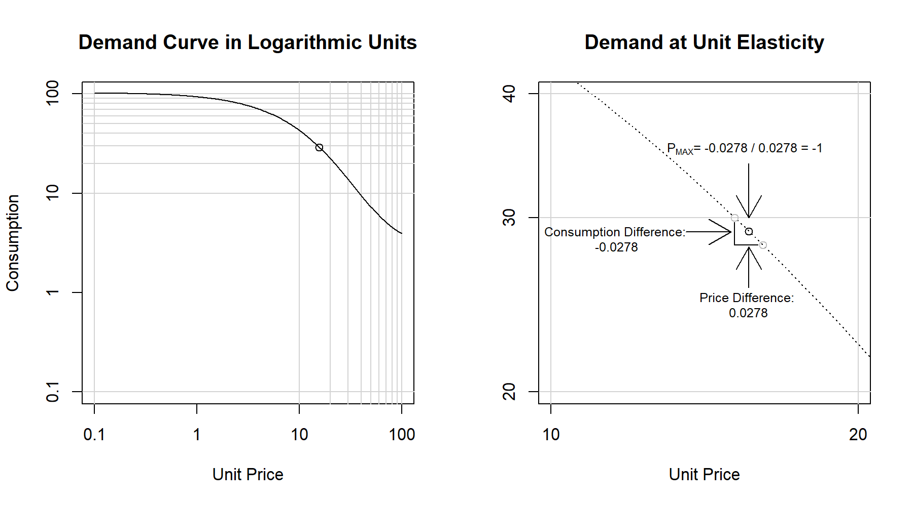

### Abstract

Research applying the behavioral economic demand framework is increasingly conducted across disciplines, as is research on improving the mathematical accuracy of demand metrics. At present, a variety of methods have been introduced to solve for the point of unit elasticity, or PMAX, in the Exponential model of demand; however, most of these methods vary in their potential for error due to being empirical approximations. Various methods for determining PMAX are presented here and a novel exact solution for PMAX in the Exponential model of demand is introduced. This solution provides an exact calculation of PMAX using the omega function, as algebraic solutions are not possible. This novel approach is introduced, discussed, and systematically compared to earlier methods for determining PMAX using computer simulations. Systematic comparison indicated that this new approach, an exact analytic solution for PMAX, provides results that are identical to computationally-intensive PMAX methods that directly evaluate the slope of the demand function. The exact analytic PMAX approach is reviewed, its calculations explained, and an easy-to-use web tool is provided to assist researchers in easily performing this calculation of PMAX. Implications for reducing potential sources of error are reviewed and future directions are also discussed.

[Markdown Source](https://github.com/miyamot0/AnalyticPmaxSource/blob/master/AnalyticPmaxSource.Rmd)

[Markdown Document](http://htmlpreview.github.com/?https://github.com/miyamot0/AnalyticPmaxSource/blob/master/AnalyticPmaxSource.html)

[Working Sample](http://www.smallnstats.com/index.php?page=PMAX)

### Introduction

Classical economic theory employs demand analyses to understand market influence on consumers’ willingness to pay for particular goods and services. Central to demand theory is the notion of demand elasticity, which is defined as the “ratio of the relative change in a dependent to the relative change in an independent variable” (Watson & Holman, 1977; p. 34). Behavioral economists have translated this concept to the consideration of reinforcement operations on operant responding. Operant behavioral economics, namely the methods specific to studying operant demand, provide a framework for quantifying response-reinforcer relationships under some type of constraint (number of responses required per unit of reinforcer, delay to reinforcement, effort associated with responding for one unit of reinforcement, etc.; e.g., Hursh, 1980, 1984; Kagel & Winkler, 1972; Rachlin, Green, Kagel, & Battalio, 1976) . Demand elasticity in operant psychology may thereby be used to provide a quantification of a reinforcer’s hedonic or motivational value.

The relationship between the consumption of a reinforcer and the requirements necessary to produce them is complex, though it has been effectively modeled in several ways (Hursh, Raslear, Bauman, & Black, 1989; Hursh & Silberberg, 2008; Koffarnus, Franck, Stein, & Bickel, 2015). Regardless of the specific model used to quantify the demand for reinforcers, the operant demand approach (hereafter considered synonymous with the simple term, “demand”) has been particularly useful in the context of various willingness-to-pay tasks – particularly, purchase tasks (Roma, Reed, DiGennaro Reed, & Hursh, 2017). In purchase tasks, the demand for substances or goods such as alcohol (Gentile, Librizzi, & Martinetti, 2012; Murphy & MacKillop, 2006), nicotine (MacKillop et al., 2008; MacKillop & Tidey, 2011), or marijuana (Aston, Metrik, & MacKillop, 2015; Collins, Vincent, Yu, Liu, & Epstein, 2014) is assessed at 
various financial costs. In these real or hypothetical situations, the monetary price to consume a reinforcer is systematically varied, and inferences are drawn based on the degree to which participants will defend their baseline levels of consumption as prices increase (Hursh, 1980, 1984).

Beyond characterizing abuse liability for drugs and other addictive substances, the operant demand framework has also been applied to other areas of choice and decision-making, such as food intake and dietary choices (Epstein et al., 2018; Epstein & Saelens, 2000; Epstein, Smith, Vara, & Rodefer, 1991; Saelens & Epstein, 1996), use of indoor tanning services (Reed, Kaplan, Becirevic, Roma, & Hursh, 2016), and general purchasing behavior (Foxall, Olivera-Castro, Schrezenmaier, & James, 2007; Foxall, Wells, Chang, & Oliveira-Castro, 2010). Additionally, more recent work has also extended this methodology to topics such as organizational behavior management e.g., workforce attrition and incentives (Henley, DiGennaro Reed, Kaplan, & Reed, 2016; Henley, DiGennaro Reed, Reed, & Kaplan, 2016), “green” consumerism (Kaplan, Gelino, & Reed, 2018), and informing interventions for individuals with developmental and/or intellectual disabilities (Gilroy, Kaplan, & Leader, 2018; Reed, Kaplan, & Becirevic, 2015; Reed et al., 2009). On a macro level, this framework has also extended to the population level, providing opportunities to develop empirically-supported public policy (Guthrie, 2017; Hursh, 1991; Hursh & Roma, 2013; MacKillop et al., 2012; Reed et al., 2016). 

### Credits

* Shawn Gilroy, Applied Behavioral Economics Laboratory, Louisiana State University [Github](https://github.com/miyamot0)

* Brent Kaplan, Carilion Research Institute, Virginia Polytechnic Institute and State University [Github](https://github.com/brentkaplan)

* Derek D. Reed, Applied Behavioral Economics Laboratory, University of Kansas (www.behavioraleconlab.com) [Github](https://github.com/derekdreed)

* Donald A. Hantula, Decision Making Laboratory, Temple University [Site](http://astro.temple.edu/~hantula/)

* Steven R. Hursh, Institutes for Behavior Resources, Johns Hopkins University School of Medicine

### Dependencies

- lambertW - Copyright Ben Bolker, port of Omega function from GSL (GPLv3).

### Table 1. Distribution of Unit Elasticity Estimates

|row             |      Q0|      Q1|      Q2|      Q3|       Q4|
|:---------------|-------:|-------:|-------:|-------:|--------:|
|AnalyticPmax    | 2.45655| 4.46924| 5.34454| 6.39693| 12.20367|
|HurshDerivative | 2.45655| 4.46924| 5.34454| 6.39693| 12.20367|
|HurshPmax       | 2.47089| 4.43210| 5.27383| 6.21326| 10.97175|
|ObservedPmax    | 1.50000| 5.00000| 6.00000| 8.00000| 20.00000|

|row             |      Q0|      Q1|      Q2|      Q3|       Q4|
|:---------------|-------:|-------:|-------:|-------:|--------:|
|AnalyticPmax    | 3.39425| 4.43719| 5.33661| 6.17661|  9.51373|
|HurshDerivative | 3.39425| 4.43719| 5.33661| 6.17661|  9.51373|
|HurshPmax       | 3.41699| 4.42331| 5.27033| 6.09176|  8.29142|
|ObservedPmax    | 2.50000| 5.00000| 6.50000| 8.00000| 20.00000|

*: Overall R2 for all series (M = 0.85, SD = 0.03)
**: Series with R2 of .9 or greater (M = 0.92, SD = 0.01)

Note: Quantile distributions for each of the unit elasticity methods.

### Table 2.

|                | HurshPmax| HurshDerivative| ObservedPmax| AnalyticPmax|
|:---------------|---------:|---------------:|------------:|------------:|
|HurshPmax       |   1.00000|         0.99584|      0.28346|      0.99584|
|HurshDerivative |   0.99584|         1.00000|      0.27524|      1.00000|
|ObservedPmax    |   0.28346|         0.27524|      1.00000|      0.27524|
|AnalyticPmax    |   0.99584|         1.00000|      0.27524|      1.00000|

|                | HurshPmax| HurshDerivative| ObservedPmax| AnalyticPmax|
|:---------------|---------:|---------------:|------------:|------------:|
|HurshPmax       |   1.00000|         0.99693|      0.43853|      0.99693|
|HurshDerivative |   0.99693|         1.00000|      0.43249|      1.00000|
|ObservedPmax    |   0.43853|         0.43249|      1.00000|      0.43249|
|AnalyticPmax    |   0.99693|         1.00000|      0.43249|      1.00000|

Note: Spearman correlation matrix for each of the four unit elasticity methods.

### Figure 1. Demand Curve and PMAX in Log-Log Space

Note: These figures above illustrate the calculation of unit elasticity (PMAX) in log-log space. The left panel illustrates the form of a conventional demand curve and the right panel illustrates the specific calculations involved. As described in the right panel, a slope of -1 on the demand curve indicates that 1 log-unit increase in price equates to a -1 log-unit decrease in levels of consumption.

### Figure 2. Model Slope and Modified Loss Function

Note: This figure illustrates a method of solving for PMAX using the first derivative. The left panel illustrates the value of the first derivative (i.e., slope) and the right panel illustrates a modified equation (i.e., a loss function) that represents a slope value of -1 as a zero point, which can then be minimized to determine Exact PMAX at a value of 0.

### Figure 3. Box Plot and Unit Elasticity Distribution

Note: This figure above illustrates the range of values the range of PMAX values resulting from each type of calculation. The information provided here highlights substantial variability in the Observed method, minimal variability in the Approximate method, and exact correspondence between Derivative and Analytic methods.

### Figure 4. Comparison of Exact and Approximated PMAX Methods

Note: This figure illustrates relationships between methods for calculating PMAX. The Observed method, constrained to prices directly measured, varied substantially from methods that directly evaluated the slope demand curve. In contrast, the Approximate method provided a consistent approximation of PMAX and the Analytic method matched exactly with the Derivative method.

### License

Copyright 2018, Shawn P. Gilroy (sgilroy1@lsu.edu)/Louisiana State University - GPLv3
